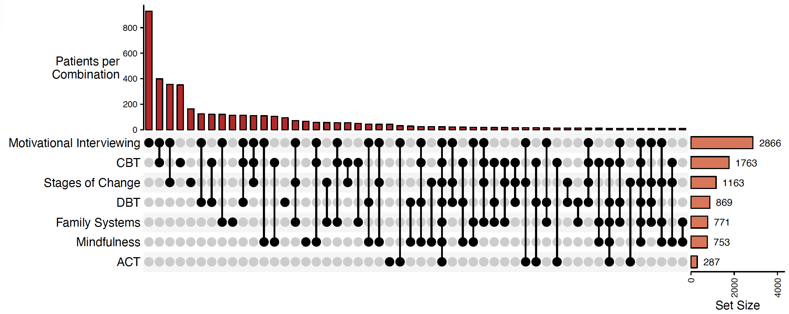
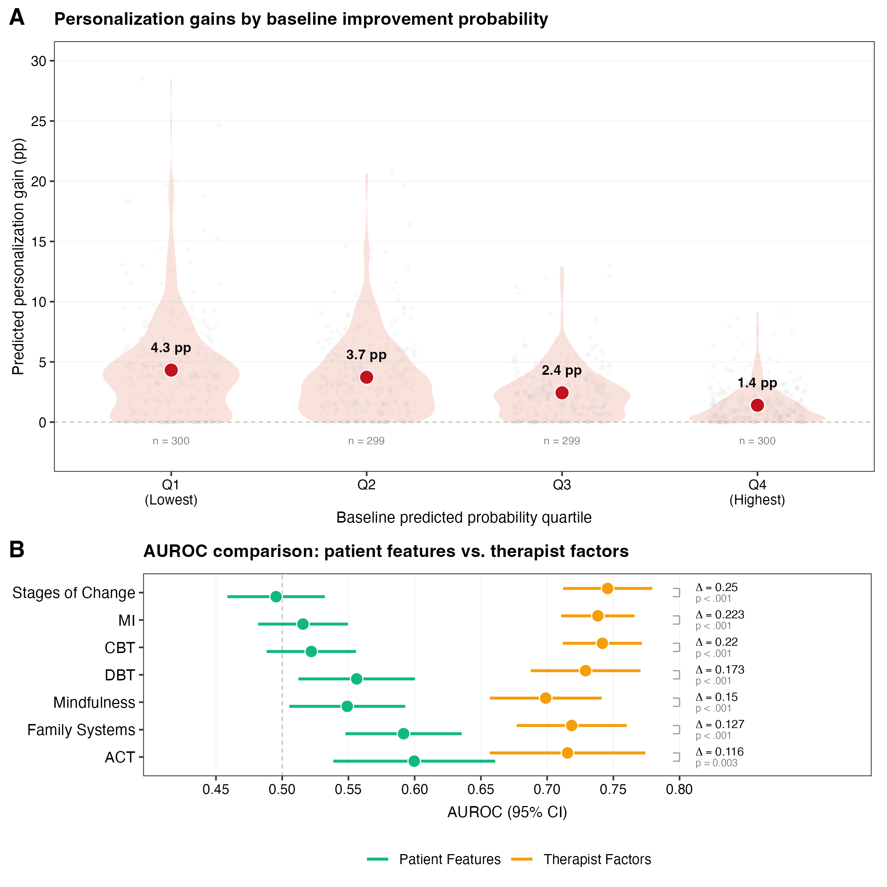
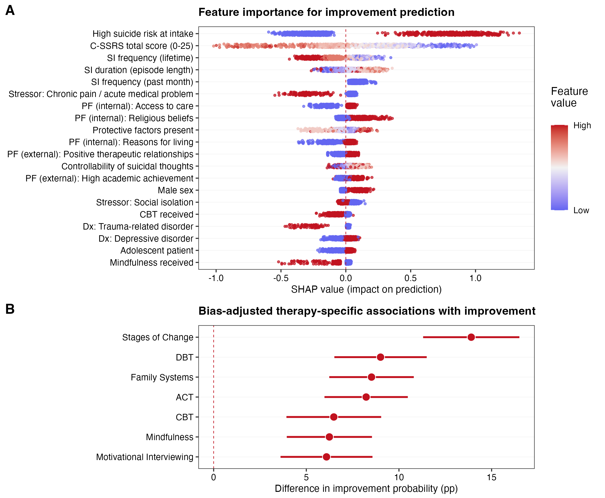
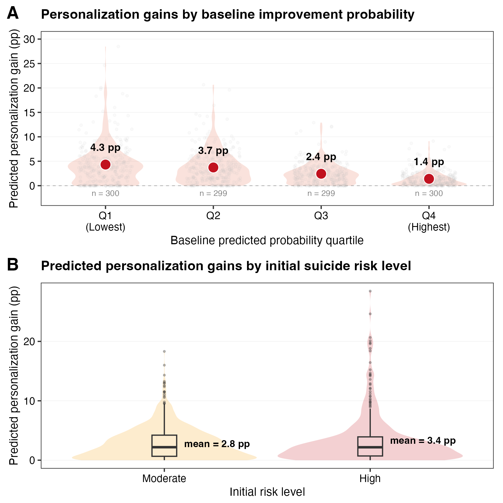

# Personalized Psychotherapy Selection for Suicide Risk Reduction

This repository contains the full analysis pipeline for the study:

**“Machine Learning to Personalize Psychotherapy Selection for Patients at Elevated Suicide Risk in a Large National Cohort.”**

The project integrates propensity score modeling, inverse-probability-weighted machine learning, doubly robust estimation, and counterfactual prediction to evaluate and optimize psychotherapy selection.

---

## Overview of Approach

The analysis proceeds in five main stages:

1. **Data Processing**  
   Construction of patient-level analytic dataset from structured intake, clinical, and therapy records.

2. **Propensity Score Estimation**  
   Modality-specific probabilities of treatment assignment estimated using ridge-regularized logistic regression.

3. **Outcome Modeling**  
   Inverse-probability-weighted XGBoost model predicting suicide risk improvement.

4. **Doubly Robust Estimation**  
   Augmented inverse probability weighting (AIPW) with cross-fitting to estimate modality-specific associations.

5. **Counterfactual Personalization**  
   Patient-level prediction of optimal therapy combinations and estimation of personalization gains.

---

## Repository Structure

```
.
├── src/                    # Core analysis scripts (run in order)
├── outputs/
│   ├── figures/            # Manuscript and supplement figures
│   ├── tables/             # Output tables used in manuscript
│   └── models/             # Saved model objects and results
├── docs/                   # Supporting materials
├── README.md
└── personalized_psychotherapy.Rproj
```

---

## Reproducibility Pipeline

Run scripts in the following order:

```
src/01_clean.R                # Data cleaning and cohort construction
src/02_propensity_scores.R   # Propensity score estimation (Table 2)
src/03_outcome_model.R       # IPW-weighted XGBoost model
src/04_doubly_robust.R       # AIPW causal estimation
src/05_counterfactual.R      # Personalization and counterfactual analysis
src/06_matching.R            # Sensitivity analysis (matching)
src/07_figures.R             # Generate all figures
src/08_tables.R              # Generate manuscript tables
src/09_sensitivity.R         # Additional robustness checks
```

---

## Key Outputs

### Figures (in `outputs/figures/`)

<table>
<tr>
<td align="center">
<b>Figure 1</b><br>
Therapy modality combinations and frequencies<br>

</td>

<td align="center">
<b>Figure 2</b><br>
Propensity model discrimination<br>

</td>
</tr>

<tr>
<td align="center">
<b>Figure 3</b><br>
Feature importance (SHAP) and ATE<br>

</td>

<td align="center">
<b>Figure 4</b><br>
Personalization gains<br>

</td>
</tr>
</table>


### Tables (in `outputs/tables/`)

- **Table 2**: Propensity model performance  
  `table2_propensity.txt`

- **Counterfactual diagnostics**  
  `counterfactual_analysis.txt`  
  `counterfactual_diagnostics.csv`

---

### Models (in `outputs/models/`)

- `aipw_xgboost_results.rds`  
  Final model outputs, including:
  - predictions  
  - personalization gains  
  - therapy effect estimates  
  - feature importance  

---

## Data Availability

The underlying data consist of de-identified electronic health records from Discovery Behavioral Health and are not publicly available due to privacy and data use agreements.

---

## Methods Summary

- **Propensity scores**: L2-regularized logistic regression (`glmnet`)  
- **Outcome model**: Gradient boosted trees (`XGBoost`) with stabilized IPW  
- **Causal estimation**: Augmented inverse probability weighting (AIPW) with cross-fitting  
- **Personalization**: Counterfactual prediction across observed therapy combinations  

## Notes

- All models use temporal train-test splits to preserve real-world deployment validity.  
- Propensity scores are used only for weighting, not as predictors in the outcome model.  
- Counterfactual predictions are restricted to the most common observed therapy combinations to ensure support.


## Reproducibility

This repository uses `renv` for dependency management.

To reproduce the analysis environment:

```r
install.packages("renv")
renv::restore()
```

This will install all package versions used in the analysis as recorded in `renv.lock`.

All analyses were conducted in R (version 4.5.3) using a fully version-locked environment (renv)

---

## Contact

For questions, contact:  
**Jacob C. Jameson** (jacobjameson@g.harvard.edu)